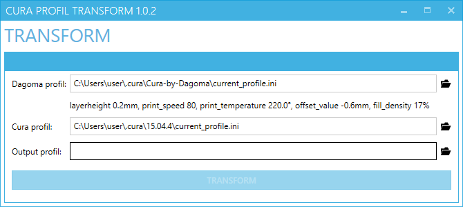
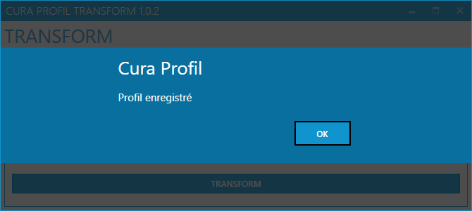
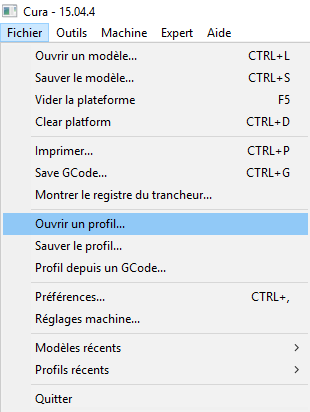

# CuraProfilMaker

`CuraProfilMaker` permet de transformer le profil en cours de `Cura-By-Dagoma` vers un fichier profil qui peux être importé dans `Cura`.

## Téléchargement ##

[CuraProfilTransform-1.0.2.0.zip](../../raw/master/dist/CuraProfilTransform-1.0.3.0.zip)

## Utilisation ##

**Dagoma Profil** : Chemin vers le profil courant de `Cura-By-Dagoma`.

le fichier profil de `Cura-By-Dagoma` est mis à jours à chaque changement d'une option de l'interface.
`CuraProfilMaker` observe les changement lorsqu'il est lancé.

**Dagoma Profil** : Chemin vers le profil de `Cura`.

Il constitue la base du fichier profil, seul les propriétés du fichier profil de cura serront importés dans le nouveau fichier profil.

**Dagoma Profil** : Chemin vers le fichier profil enregistré.

**TRANSFORM** : Génère le fichier profil. 

## Importation du fichier profil dans Cura ##

## Notes  ##

Les options suivantes de `Cura-By-Dagoma` sont prise en compte :

- L'instruction `;{palpeur}` du Gcode start est remplacé par `G29`
- Le `{z_offset}` est remplacé par l'offset configuré dans `Cura-By-Dagoma`

`Cura-By-Dagoma` enregistre le `start.gcode` dans `start5.gcode`, il est automatiquement remapé par `CuraProfilMaker` (même principe pour `end.gcode` et `end5.gcode`).

- la configuration `plugin_config` est ignoré.
- pareil pour les configurations `"start2.gcode", "end2.gcode", "start3.gcode", "end3.gcode", "start4.gcode", "end4.gcode"`.